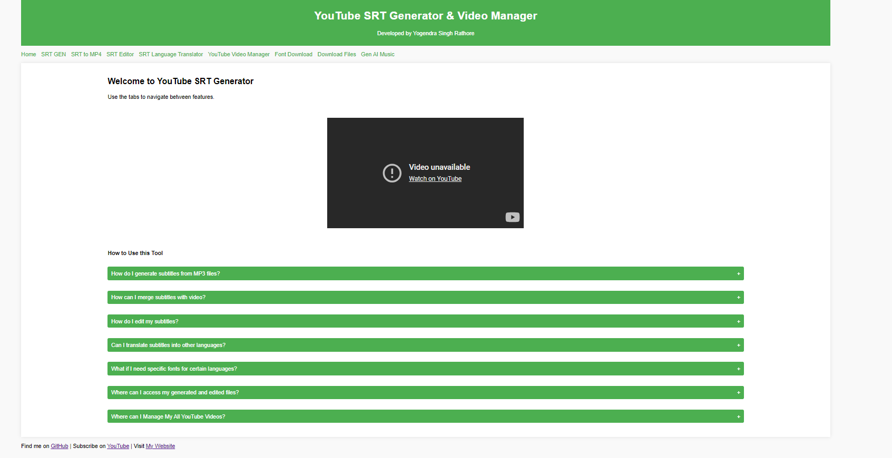
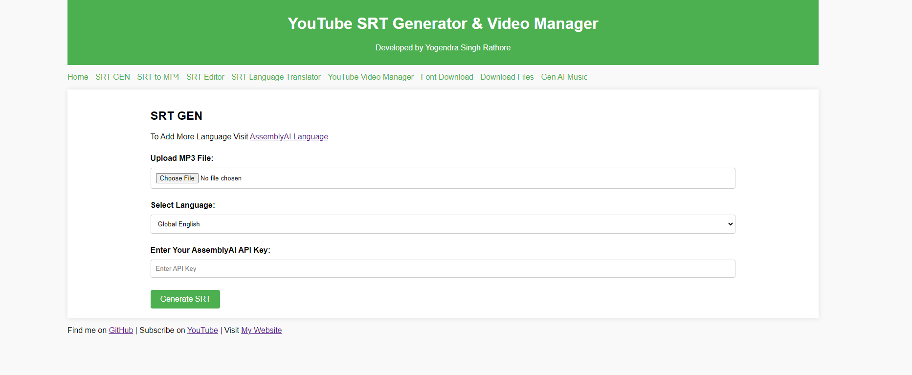
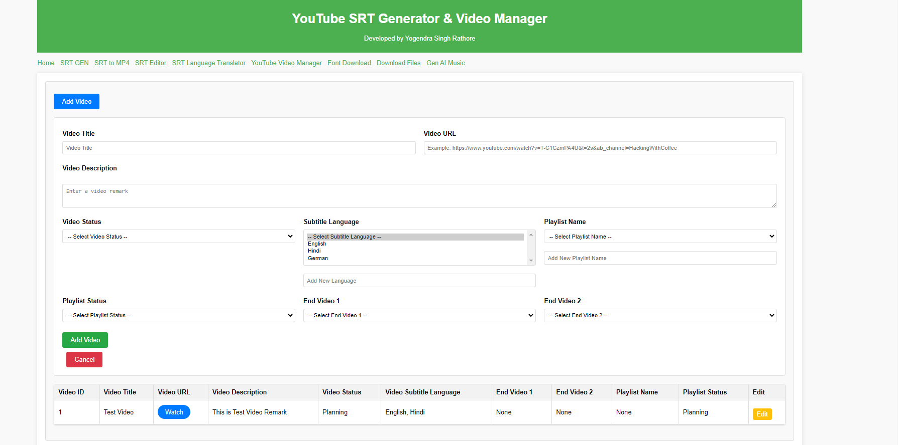
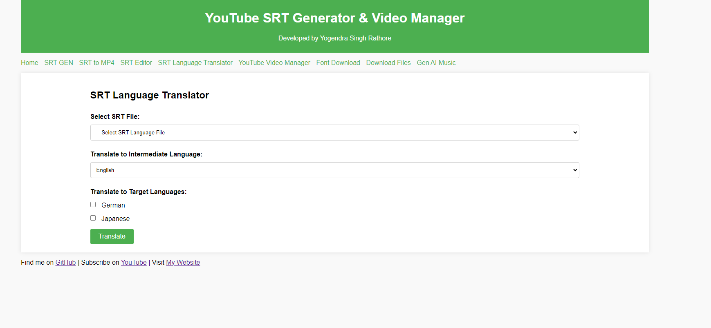
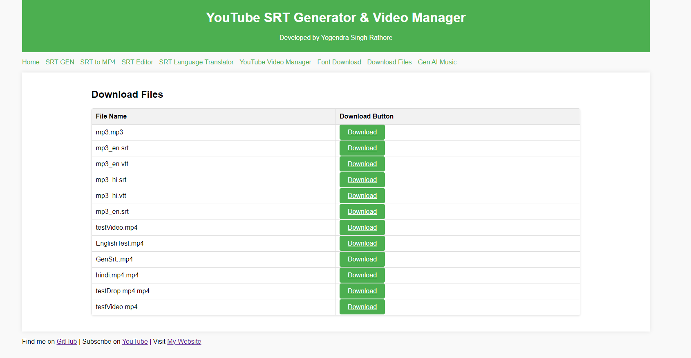

<h1 align="center">
  <br>
  <a href="https://github.com/yogendra-singh-rathore/youtube_SRT_AI/"></a>
</h1>

# YouTube SRT Generator, Translation and Compilation
<h4 align="center">By- Yogendra Singh Rathore</h4>

This project automates the generation and translation of SRT (SubRip Subtitle) files using Assembly AI, followed by translating these subtitles into multiple languages. Finally, it compiles the translated SRT files into MP3 and MP4 formats to ensure they match the timeline of the original video.

## Updates Table
| Update    | Status | Version |
| -------- | ------- | ------- |
| Web App v3.0 | Done | V3.0 |
| Docker App | Done | m3evil/flsk-srt-genai:3.0 |

## Features

- Generate Mp3 To Subtitle 
- Edit Subtitals with Demo Video (Create Demo MP4 with Generated Subtitles )
- Translate Subtitles in Multiple Languages
- Download Fonts as per Languages
- Download Files
- Manage All of Your YouTube Videos and Keep up-to-date YouTube videos Data (in YouTube Manager)

## Prerequisites

- Python 3.11.4
- Assembly AI API key
- Required Python packages (can be installed via `requirements.txt`)

## Installation Python File
#### File Structure

- `srtAi.py`: Script to generate SRT files in Hindi using Assembly AI.
- `translate.py`: Script to translate Hindi SRT files into English and other languages.
- `srt_mp3.py`: Script to compile translated SRT files into MP3 and generate MP4 for timeline verification.
  
1. Clone the repository:

    ```bash
    git clone git@github.com:yogendra-singh-rathore/youtube_SRT_AI.git
    cd youtube_SRT_AI
    ```

2. Install the required packages:

    ```bash
    pip install -r requirements.txt
    ```

3. Set up your Assembly AI API key in the main.py:

    ```bash
    aai.settings.api_key = "API KEY"
    ```

## Usage

### Generating and Translating SRT Files

1. **CLI Generate SRT in Hindi:**

    Run the `srtAi.py` script to generate SRT files in Hindi using Assembly AI.

    ```bash
    python srtAi.py
    ```

    Assembly AI supports various languages. For a complete list of supported languages and their corresponding language codes, refer to the [Assembly AI Supported Languages](https://www.assemblyai.com/docs/concepts/supported-languages) documentation.

2. **CLI Translate SRT Files:**

    Use the `translate.py` script to translate the Hindi SRT files into English and then into other languages (German, Chinese, Japanese, etc.).

    ```bash
    python translate.py
    ```

### Compiling SRT to MP3 and MP4

1. **CLI Compile SRT to MP3:**

    Run the `srt_mp3.py` script to compile the translated SRT files into MP3.

    ```bash
    python srt_mp3.py
    ```

2. **CLI Generate MP4 with SRT:**

    The `srt_mp3.py` script also generates an MP4 file to check if the SRT matches the timeline of the original video.

    ```bash
    python srt_mp3.py
    ```

  
## Install Flask Web Application (GUI)











1. **Run App: Easy To Use**
    ```bash
    python main.py
    ```
## Install Docker Image
Pull Docker Image
  ```bash
    docker pull m3evil/flsk-srt-genai:3.0
  ```
Create a New Folder In the Local Machine
  ```bash
    mkdir youtubeManager
  ```
Copy Files From Docker to the Local Machine
  ```bash
    docker container run -d --name temp-container m3evil/flsk-srt-genai:3.0
    docker cp temp-container:app/output/. "./output"
    docker container stop temp-container
    docker container rm temp-container 
  ```
Run Web App And Store Data in the Local Machine
  ```bash
    docker container run -d -p 3000:3000 -v ".\output:/output" m3evil/flsk-srt-genai:3.0
  ```

## Dependencies

The following versions are required:

- `assemblyai==0.28.1`
- `deep-translator==1.11.4`
- `moviepy==1.0.3`
- `pysrt==1.1.2`

## License

This project is licensed under the MIT License.

## Acknowledgments

- Thanks to Assembly AI for providing the transcription service.
- Me (Yogendra Singh Rathore)
