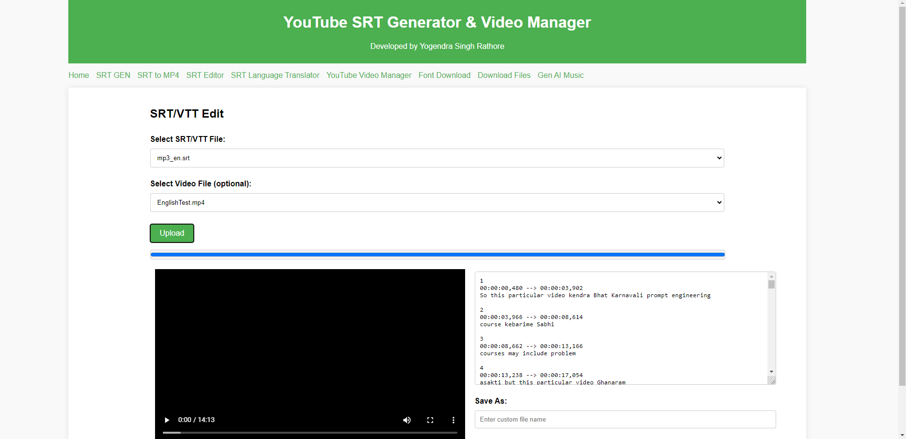
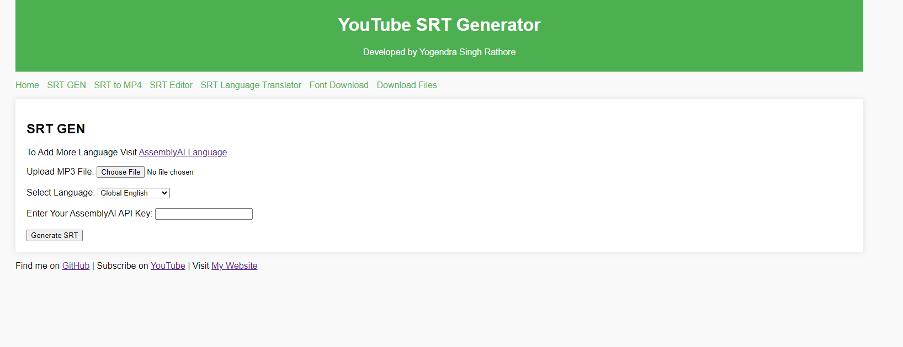
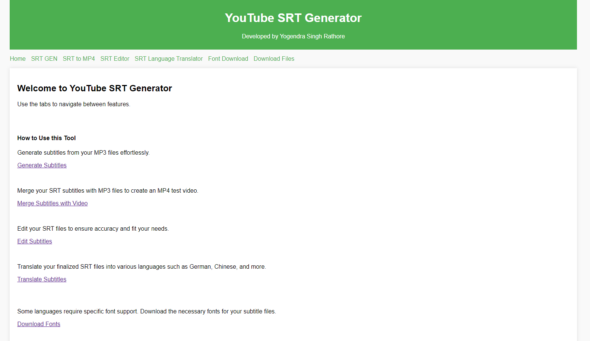

<h1 align="center">
  <br>
  <a href="https://github.com/yogendra-singh-rathore/youtube_SRT_AI/"></a>
</h1>

# YouTube SRT Generator, Translation and Compilation

This project automates the generation and translation of SRT (SubRip Subtitle) files using Assembly AI, followed by translating these subtitles into multiple languages. Finally, it compiles the translated SRT files into MP3 and MP4 formats to ensure they match the timeline of the original video.

## Features

- Generate SRT files in Hindi(you can Change language) using Assembly AI.
- Translate Hindi(you can Change language) SRT files into English.
- Further translate English SRT files into multiple languages (German, Chinese, Japanese, etc.).
- Compile SRT files into MP3.
- Merge SRT with video to produce MP4 for timeline verification.

## Prerequisites

- Python 3.11.4
- Assembly AI API key
- Required Python packages (can be installed via `requirements.txt`)

## Installation

1. Clone the repository:

    ```bash
    git clone <repository-url>
    cd <repository-directory>
    ```

2. Install the required packages:

    ```bash
    pip install -r requirements.txt
    ```

3. Set up your Assembly AI API key:

    ```bash
    export ASSEMBLYAI_API_KEY='your_api_key_here'
    ```

## Usage

### Generating and Translating SRT Files

1. **CLI Generate SRT in Hindi:**

    Run the `srtAi.py` script to generate SRT files in Hindi using Assembly AI.

    ```bash
    python srtAi.py
    ```

    Assembly AI supports various languages. For a complete list of supported languages and their corresponding language codes, refer to the [Assembly AI Supported Languages](https://www.assemblyai.com/docs/concepts/supported-languages) documentation.

2. **CLI Translate SRT Files:**

    Use the `translate.py` script to translate the Hindi SRT files into English and then into other languages (German, Chinese, Japanese, etc.).

    ```bash
    python translate.py
    ```

### Compiling SRT to MP3 and MP4

1. **CLI Compile SRT to MP3:**

    Run the `srt_mp3.py` script to compile the translated SRT files into MP3.

    ```bash
    python srt_mp3.py
    ```

2. **CLI Generate MP4 with SRT:**

    The `srt_mp3.py` script also generates an MP4 file to check if the SRT matches the timeline of the original video.

    ```bash
    python srt_mp3.py
    ```
### ==> We Have Web Application





1. **Our Flask-based Web App:**
   Add "Assembly AI API KEY" in 'main.py'
    ```bash
    python main.py
    ```
    
## File Structure

- `srtAi.py`: Script to generate SRT files in Hindi using Assembly AI.
- `translate.py`: Script to translate Hindi SRT files into English and other languages.
- `srt_mp3.py`: Script to compile translated SRT files into MP3 and generate MP4 for timeline verification.

## Dependencies

The following versions are required:

- `assemblyai==0.28.1`
- `deep-translator==1.11.4`
- `moviepy==1.0.3`
- `pysrt==1.1.2`

## License

This project is licensed under the MIT License.

## Acknowledgments

- Thanks to Assembly AI for providing the transcription service.
- Me (Yogendra Singh Rathore)
